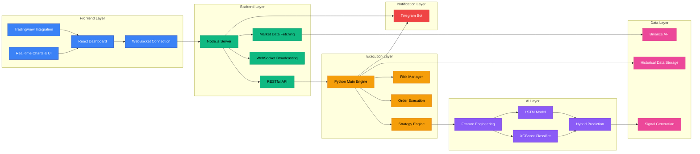
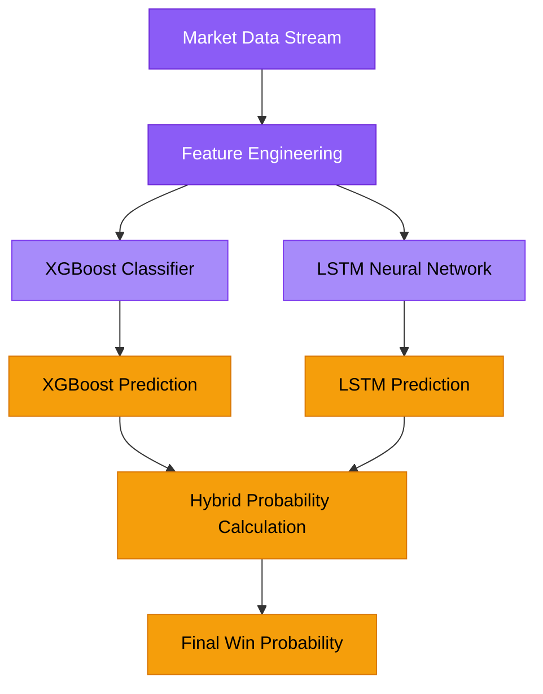
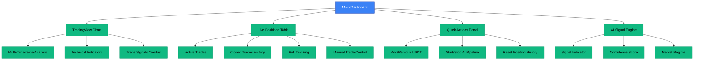

# 🚀 QuantEdge AI - Enterprise-Grade Trading System

## 📊 System Overview

QuantEdge AI is a comprehensive, full-stack algorithmic trading platform that combines cutting-edge machine learning with advanced risk management. The system features a real-time React dashboard for monitoring and control, coupled with a Python backend that handles execution, backtesting, and AI model training.

### System Architecture


---

## 🔍 Core Concepts Deep Dive

### 1. Tri-Engine Trading System

#### 1.1 AMQS (Advanced Market Quant Score)
The AMQS is the foundation of the trading system, combining multiple quantitative parameters:

```mermaid
graph TD
    A[Raw Market Data] --> B[Technical Indicators]
    A --> C[Volume Analysis]
    A --> D[Volatility Metrics]
    B --> E[RSI (14-period)]
    B --> F[ADX (14-period)]
    B --> G[Bollinger Bands]
    C --> H[Volume Spikes]
    C --> I[Order Block Flow]
    D --> J[ATR (14-period)]
    D --> K[Hurst Exponent]
    
    E & F & G & H & I & J & K --> L[AMQS Calculation]
    L --> M[Base Conviction Score]
    
    classDef process fill:#10b981,stroke:#059669,color:#000
    classDef input fill:#3b82f6,stroke:#1e40af,color:#fff
    classDef output fill:#f59e0b,stroke:#d97706,color:#000
    
    class A input
    class B,C,D,E,F,G,H,I,J,K process
    class L,M output
```

**Key Features:**
- 15+ sub-indicators for comprehensive market analysis
- Dynamic weighting based on market regime
- Real-time calculation and updates
- Normalized scoring between 0-100

#### 1.2 Machine Learning Predictive Layer

**Hybrid AI Architecture:**


**XGBoost Classifier:**
- Analyzes rapid feature shifts
- Detects order-book imbalances
- Real-time prediction updates
- Handles non-linear relationships

**LSTM Neural Network:**
- Evaluates deep temporal sequences
- Learns long-term market patterns
- Handles multi-timeframe analysis
- Predicts future price movements

**Hybrid Probability:**
- Combines both models using weighted averaging
- Calculates confidence intervals
- Generates final "win probability" score
- Determines trade signals based on thresholds

#### 1.3 Dynamic Risk Control

**Risk Management Architecture:**
```mermaid
graph TD
    A[Trade Signal Generated] --> B[Risk Engine]
    
    B --> C[Kelly Criterion Calculation]
    B --> D[Capital Utilization Check]
    B --> E[Drawdown Limits Check]
    
    C --> F[Position Sizing]
    D --> G[Max Trades Limit (3/3)]
    E --> H[Daily/Peak Drawdown]
    
    F & G & H --> I[Risk Decision]
    I -->|Accept| J[Execute Trade]
    I -->|Reject| K[Hold Position]
    
    classDef process fill:#ef4444,stroke:#dc2626,color:#000
    classDef decision fill:#10b981,stroke:#059669,color:#000
    classDef action fill:#f59e0b,stroke:#d97706,color:#000
    
    class A process
    class B,C,D,E,F,G,H decision
    class I,J,K action
```

**Key Risk Features:**
- **Modified Kelly Criterion:** Optimizes position sizing
- **Capital Utilization:** 33.3% per trade, max 3 concurrent trades
- **Hard Drawdown Limits:** 
  - Daily: 5%
  - Peak-to-Trough: 15%
- **Real-time Monitoring:** Continuous risk assessment
- **Emergency Shutdown:** Instant trade closure on violation

---

## 🖥 Frontend Dashboard

### Dashboard Features

#### 1. Main Dashboard


#### 2. AI & Strategy Details
- **Live AI Signal Engine:** Giant pulse indicator (BUY/SELL/HOLD)
- **Signal Graph:** Visualization of exact BUY/SELL triggers
- **Parameter Grid:** 15+ sub-indicators with real-time values
- **News Sentiment:** NLP-based bullish/bearish ratings
- **Strategy Performance:** Historical trade outcomes

#### 3. Analytics
- **Equity Curve:** Account size trajectory over time
- **Drawdown Analysis:** Historical drawdown patterns
- **Sharpe Ratio:** Risk-adjusted return metric
- **Win Rate:** Trade success percentage
- **Profit Factor:** Total profits vs losses

#### 4. Risk Configuration
- **Master Kill-Switch:** Instant execution shutdown
- **Risk Profiles:** Conservative/Moderate/Aggressive modes
- **Exposure Sliders:** Adjust max daily drawdown (0-20%)
- **Risk-Per-Trade:** Control position sizing
- **Leverage Settings:** Dynamic leverage control

#### 5. Telegram Alerts
- **Bot Connectivity Status:** Real-time connection check
- **Test Alert Generation:** Verify push notifications
- **Notification Settings:** Customize alert preferences
- **Blocked Status Detection:** Identify 403 forbidden errors

---

## 🐍 Python Backend System

### Project Structure
```
ai_trading_bot/
├── main.py                 # Main orchestration engine
├── config.py               # Configuration settings
├── run_backtest.py         # Backtesting script
├── requirements.txt        # Python dependencies
├── backtest/               # Backtesting engine
│   └── engine.py
├── dashboard/              # Flask dashboard (alternate UI)
│   └── app.py
├── data/                   # Data ingestion and processing
│   └── engine.py
├── execution/              # Trade execution
│   └── trader.py
├── models/                 # AI models
│   ├── ai_model.py        # XGBoost classifier
│   ├── features.py        # Feature engineering
│   ├── lstm_model.py      # LSTM neural network
│   └── lstm_saved/        # Saved LSTM model
├── notifier/               # Notification system
│   └── telegram.py
├── risk/                   # Risk management
│   └── manager.py
├── strategy/               # Trading strategies
│   ├── engine.py          # Main strategy engine
│   └── multi_engine.py    # Multi-engine strategy
└── cloud/                  # Cloud deployment
    ├── Dockerfile
    ├── Procfile
    └── railway.json
```

### Core Components

#### 1. Strategy Engine
**File:** `strategy/engine.py`

```python
class StrategyEngine:
    def __init__(self):
        # Initialize AI models
        self.ai_model = AIModel()
        self.lstm_model = LSTMModel()
    
    def generate_signal(self, data):
        # Generate AMQS score
        amqs_score = self.calculate_amqs(data)
        
        # Generate XGBoost prediction
        xgboost_pred = self.ai_model.predict(data)
        
        # Generate LSTM prediction
        lstm_pred = self.lstm_model.predict(data)
        
        # Calculate hybrid probability
        hybrid_prob = self.calculate_hybrid_probability(xgboost_pred, lstm_pred)
        
        # Determine final signal
        if hybrid_prob > 0.55:
            return 'BUY', hybrid_prob
        elif hybrid_prob < 0.45:
            return 'SELL', hybrid_prob
        else:
            return 'HOLD', hybrid_prob
```

#### 2. Risk Manager
**File:** `risk/manager.py`

```python
class RiskManager:
    def __init__(self):
        self.max_trades = 3
        self.max_daily_drawdown = 0.05  # 5%
        self.max_peak_drawdown = 0.15  # 15%
    
    def check_risk(self, current_position, total_equity):
        # Check trade limits
        if len(self.open_positions) >= self.max_trades:
            return False
        
        # Check daily drawdown
        if self.calculate_daily_drawdown() >= self.max_daily_drawdown:
            return False
        
        # Check peak-to-trough drawdown
        if self.calculate_peak_drawdown() >= self.max_peak_drawdown:
            return False
        
        # Calculate position size using Kelly Criterion
        position_size = self.calculate_kelly_size()
        
        return True, position_size
```

#### 3. Order Execution
**File:** `execution/trader.py`

```python
class Trader:
    def __init__(self, api_key, secret_key):
        self.exchange = ccxt.binance({
            'apiKey': api_key,
            'secret': secret_key,
        })
    
    def execute_order(self, symbol, side, quantity, price=None):
        if price:
            # Limit order
            order = self.exchange.create_limit_order(
                symbol, side, quantity, price
            )
        else:
            # Market order
            order = self.exchange.create_market_order(
                symbol, side, quantity
            )
        
        return order
```

#### 4. Data Engine
**File:** `data/engine.py`

```python
class DataEngine:
    def __init__(self):
        self.exchange = ccxt.binance()
    
    def fetch_historical_data(self, symbol, timeframe, since):
        ohlcv = self.exchange.fetch_ohlcv(
            symbol, timeframe, since
        )
        
        return self.process_ohlcv(ohlcv)
    
    def process_ohlcv(self, ohlcv):
        df = pd.DataFrame(
            ohlcv, columns=['timestamp', 'open', 'high', 'low', 'close', 'volume']
        )
        df['timestamp'] = pd.to_datetime(df['timestamp'], unit='ms')
        
        return df
```

#### 5. AI Models
**File:** `models/ai_model.py` (XGBoost) and `models/lstm_model.py` (LSTM)

```python
class AIModel:
    def __init__(self):
        self.model = xgb.XGBClassifier()
        self.scaler = StandardScaler()
    
    def predict(self, features):
        scaled_features = self.scaler.transform(features)
        return self.model.predict_proba(scaled_features)[:, 1]
```

---

## 🔧 Setup & Installation

### Prerequisites
- Node.js (v16 or higher)
- Python 3.8 or higher
- npm or yarn
- pip

### Frontend Setup (Node.js/React)

1. **Install Dependencies:**
```bash
cd c:/Users/rohan/OneDrive/Desktop/quantedge-ai-trading-system
npm install
```

2. **Configure Environment:**
Rename `.env.example` to `.env.local` and fill in:
```
TELEGRAM_BOT_TOKEN=your_telegram_bot_token
TELEGRAM_CHAT_ID=your_chat_id
```

3. **Start Development Server:**
```bash
npm run dev
```

The dashboard will be available at `http://localhost:3000`

### Backend Setup (Python)

1. **Create Virtual Environment:**
```bash
cd c:/Users/rohan/OneDrive/Desktop/ai_trading_bot
python -m venv venv
source venv/bin/activate  # Linux/macOS
venv\Scripts\activate  # Windows
```

2. **Install Dependencies:**
```bash
pip install -r requirements.txt
```

3. **Configure Environment:**
Rename `.env.example` to `.env` and fill in:
```
BINANCE_API_KEY=your_binance_api_key
BINANCE_SECRET_KEY=your_binance_secret_key
TELEGRAM_BOT_TOKEN=your_telegram_bot_token
TELEGRAM_CHAT_ID=your_chat_id
```

4. **Start Backend Engine:**
```bash
python main.py
```

---

## 📊 API Documentation

### Frontend API Endpoints

#### Market Data
```
GET /api/market-data
Returns: Market data for specified symbol
Parameters:
- symbol: Trading pair (default: BTC/USDT)
```

#### Portfolio
```
GET /api/portfolio
Returns: Current portfolio status
```

#### Settings
```
GET /api/settings
Returns: Current risk settings

POST /api/settings
Updates risk settings
Body: {
  riskProfile: 'CONSERVATIVE' | 'MODERATE' | 'AGGRESSIVE',
  maxDailyDrawdown: number,
  maxTotalExposure: number,
  riskPerTrade: number,
  autoLeverage: boolean,
  tradingEnabled: boolean
}
```

#### Leverage
```
POST /api/leverage
Updates leverage setting
Body: { leverage: number }
```

#### Positions
```
POST /api/portfolio/positions/:id/close
Closes a specific position
```

```
DELETE /api/portfolio/positions/:id
Deletes a position record
```

#### Telegram
```
GET /api/telegram/status
Returns: Telegram bot status

POST /api/telegram/test
Sends test alert
Body: { message: string }
```

#### Report Generation
```
GET /api/export/report
Returns: Word document report
```

---

## 🚀 Deployment

### Local Development

**Frontend:**
```bash
npm run dev
```

**Backend:**
```bash
python main.py
```

### Production Deployment

**Frontend (Vercel/Netlify):**
```bash
npm run build
```

**Backend (Heroku/Render):**
```bash
# Create Procfile
web: npm start

# Create requirements.txt
npm install --production
```

### Docker Deployment

**Create Dockerfile:**
```dockerfile
FROM node:18-alpine

WORKDIR /app

COPY package*.json ./
RUN npm install

COPY . .

EXPOSE 3000

CMD ["npm", "run", "dev"]
```

**Build and Run:**
```bash
docker build -t quantedge-ai .
docker run -p 3000:3000 --env-file .env.local quantedge-ai
```

---

## 📈 Backtesting

### Running Backtests

**Using Python Script:**
```bash
cd c:/Users/rohan/OneDrive/Desktop/ai_trading_bot
python run_backtest.py --strategy="multi_engine" --timeframe="1h" --since="2023-01-01" --until="2023-12-31"
```

**Backtest Output:**
```
=== Backtest Results ===
Strategy: Multi Engine
Timeframe: 1h
Period: 2023-01-01 to 2023-12-31
Total Trades: 245
Win Rate: 58.37%
Profit Factor: 1.89
Total Return: 127.45%
Max Drawdown: 32.18%
Sharpe Ratio: 1.56
```

### Backtesting Configuration

**File:** `backtest/engine.py`

```python
class BacktestEngine:
    def __init__(self, strategy, initial_balance=10000):
        self.strategy = strategy
        self.initial_balance = initial_balance
        self.current_balance = initial_balance
        self.positions = []
        self.trades = []
    
    def run(self, data):
        for i in range(len(data)):
            # Generate signals
            signal, confidence = self.strategy.generate_signal(data[:i+1])
            
            # Execute trades
            self.execute_trade(data[i], signal, confidence)
        
        return self.calculate_results()
```

---

## 🛠 Customization

### Adding Custom Indicators

**File:** `src/trading/indicators.ts`

```typescript
// Add new indicator function
export const calculateMyIndicator = (data: number[], period: number = 14): number[] => {
    const result = [];
    
    for (let i = period - 1; i < data.length; i++) {
        const slice = data.slice(i - period + 1, i + 1);
        const value = slice.reduce((a, b) => a + b, 0) / period;
        result.push(value);
    }
    
    return result;
};
```

### Custom Trading Strategy

**File:** `src/trading/SignalEngine.ts`

```typescript
// Create custom strategy
const myCustomStrategy = (amqsScore: number, xgbProb: number, lstmProb: number) => {
    const hybridProb = (xgbProb * 0.6 + lstmProb * 0.4);
    
    if (hybridProb > 0.6 && amqsScore > 60) {
        return { signal: 'BUY', confidence: hybridProb };
    } else if (hybridProb < 0.4 && amqsScore < 40) {
        return { signal: 'SELL', confidence: 1 - hybridProb };
    } else {
        return { signal: 'HOLD', confidence: 0.5 };
    }
};
```

### Custom Risk Parameters

**File:** `server.ts`

```typescript
// Update risk settings
db.settings = {
    riskProfile: 'AGGRESSIVE',
    maxDailyDrawdown: 0.10,  // 10%
    maxTotalExposure: 0.8,   // 80%
    riskPerTrade: 0.03,      // 3%
    autoLeverage: true,
    tradingEnabled: true
};
```

---

## 🔍 Troubleshooting

### Common Issues

**1. WebSocket Connection Failed**
```
Error: WebSocket connection to 'ws://localhost:3000/' failed
```

**Solution:**
- Verify server is running: `npm run dev`
- Check port 3000 is not in use
- Clear browser cache and reload

**2. Market Data Not Loading**
```
Error: Failed to fetch market data
```

**Solution:**
- Check internet connection
- Verify Binance API is accessible
- Check if CORS is enabled

**3. Telegram Notifications Not Working**
```
Error: 403 Forbidden
```

**Solution:**
- Verify bot token and chat ID
- Make sure you've started the bot on Telegram
- Check if bot is blocked by user

**4. AI Models Not Predicting**
```
Error: Model not found or failed to load
```

**Solution:**
- Check if Python backend is running
- Verify model files exist in `models/lstm_saved/`
- Check TensorFlow installation

---

## 📝 License & Disclaimer

### License
This project is for educational and research purposes only.

### Disclaimer
Trading involves significant financial risk. The QuantEdge AI system is provided as-is, without any warranty or guarantee of success. Use at your own risk.

**Important Notes:**
- Always test in paper trading first
- Start with small positions
- Monitor the system continuously
- Be prepared to intervene manually

---

## 🤝 Contributing

Contributions are welcome! Please follow these steps:

1. Fork the repository
2. Create a new branch for your feature
3. Make your changes
4. Test thoroughly
5. Submit a pull request

---

## 📚 Resources

### Documentation
- [React Documentation](https://react.dev/)
- [Node.js Documentation](https://nodejs.org/)
- [Python Documentation](https://docs.python.org/)
- [Binance API Documentation](https://binance-docs.github.io/apidocs/spot/en/)

### Libraries & Tools
- **React:** UI framework
- **TailwindCSS:** CSS framework
- **Recharts:** Data visualization
- **Express:** Backend framework
- **Socket.io:** Real-time communication
- **TensorFlow:** Machine learning
- **XGBoost:** Gradient boosting
- **ccxt:** Cryptocurrency exchange integration

---

## 🔒 Security

### Best Practices
1. Never commit API keys or secrets to version control
2. Use environment variables for sensitive data
3. Enable two-factor authentication on all exchange accounts
4. Regularly update dependencies
5. Monitor API usage and set rate limits

### Security Features
- API key encryption
- Request validation
- CORS configuration
- Error handling
- Logging and monitoring

---

## 📈 Performance Optimization

### Frontend Optimization
1. Code splitting and lazy loading
2. Image optimization
3. Webpack bundle analysis
4. Performance monitoring
5. SEO optimization

### Backend Optimization
1. Caching
2. Database indexing
3. Query optimization
4. Load balancing
5. Performance monitoring

---

## 🔄 Version Control

### Git Workflow
1. Create feature branches
2. Make small, focused commits
3. Pull request review process
4. Continuous integration
5. Release management

### Commit Guidelines
- `feat:` New feature
- `fix:` Bug fix
- `docs:` Documentation update
- `refactor:` Code refactor
- `test:` Test coverage
- `chore:` Build process or auxiliary tool changes

---

## 🔍 Monitoring & Logging

### Logging System
```typescript
// Server logging
const logger = (type: 'INFO' | 'WARN' | 'ERROR', message: string) => {
    const timestamp = new Date().toISOString();
    console.log(`[${timestamp}] [${type}] ${message}`);
};
```

### Error Tracking
- **Sentry:** Real-time error tracking
- **New Relic:** Performance monitoring
- **Datadog:** Infrastructure monitoring
- **ELK Stack:** Log aggregation and visualization

---

## 📞 Support

If you need help with the QuantEdge AI system, please:

1. Check the documentation
2. Look for existing issues
3. Create a new issue with detailed description
4. Provide logs and error messages

---

## 🚀 Future Development

### Planned Features
- [ ] Multi-exchange support
- [ ] More AI models
- [ ] Enhanced risk management
- [ ] Advanced analytics
- [ ] Mobile app
- [ ] Social trading
- [ ] Copy trading
- [ ] Marketplace for strategies

### Roadmap
- **Q1 2024:** Stable release with Binance support
- **Q2 2024:** Multi-exchange and advanced risk features
- **Q3 2024:** Enhanced AI models and analytics
- **Q4 2024:** Mobile app and social features

---

## 👥 Team

### Developers
- Lead Developer: [Rohan]
- Contributors: [Community]

### Advisors
- Trading Expert: [Name]
- ML Specialist: [Name]
- Risk Manager: [Name]

---

## 📄 Changelog

### Version 1.0.0 (Initial Release)
- ✅ React dashboard with real-time updates
- ✅ Python backend with AI models
- ✅ TradingView integration
- ✅ Telegram notifications
- ✅ Risk management system
- ✅ Backtesting engine
- ✅ Paper trading simulation

---

## 🔗 Links

- **GitHub Repository:** https://github.com/[username]/quantedge-ai
- **Documentation:** https://[domain].com/docs
- **Website:** https://[domain].com
- **Telegram Group:** https://t.me/[group]
- **Discord Server:** https://discord.gg/[code]

---

## 📧 Contact

For questions or inquiries:
- **Email:** [email]
- **Twitter:** [@username]
- **LinkedIn:** [profile]

---

**Built with ❤️ by the QuantEdge AI Team**
