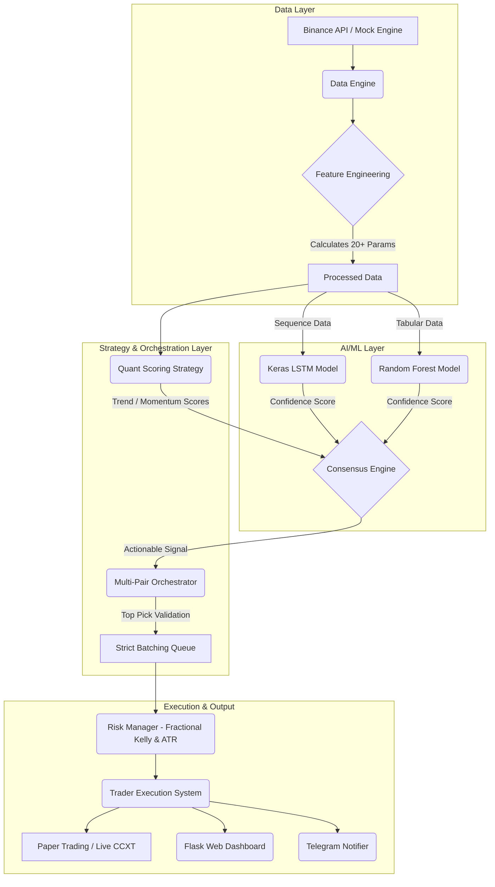

# 🤖 QuantEdge AI Trading System


QuantEdge is a professional-grade, institutional-inspired algorithmic trading bot developed in Python. It supports multi-pair orchestration, Deep Learning (LSTM), Random Forest (RF) ensembles, and 20+ advanced quantitative finance indicators to dominate in multiple market regimes.

---

## 🏗️ System Architecture

The core philosophy of QuantEdge is extreme modularity. Data fetching, feature engineering, AI predictions, risk management, and order execution are strictly separated.



---

## 🚀 Core Features & Concepts

### 1. Dual-Model Generative AI Engine
We don't rely on simple moving average crossovers. QuantEdge utilizes a consensus model:
*   **Deep Learning LSTM (Long Short-Term Memory)**: Analyzes sequential time-series windows to recognize complex patterns and regime shifts.
*   **Random Forest Classifier**: Extracts feature importance from purely tabular market indicators, acting as a high-precision filter for the LSTM's predictions.

### 2. Multi-Pair Orchestrator & Strict Batching
The system scans `N` cryptocurrency pairs simultaneously. If multiple pairs trigger valid signals, the orchestrator ranks them based on AI confidence levels and quantitative scores. 
*   **Max 3 Trades Batching**: To prevent over-exposure, the bot locks entries after opening 3 positions. It will patiently wait until *all 3 positions* are resolved before taking a new batch of trades.

### 3. Institutional Risk Management
*   **ATR-Based Dynamic Stops**: Stop Loss and Take Profit levels breathe with market volatility calculated via Average True Range (ATR).
*   **Maximum Capital Utilization**: The bot dynamically divides the total available capital (e.g., $10,000) evenly across the maximum allowed open trades (e.g., 33.3% per trade), maximizing AI-driven leverage without margin liquidation risk.
*   **Hard Drawdown Circuit Breakers**: If the portfolio drops by a configurable percentage from its peak, the bot pauses all trading to protect principal.

### 4. Live Command Center Dashboard
A native Flask application running concurrently on a separate daemon thread allows for real-time portfolio monitoring.
*   Monitor PnL, Win Rate, and Sharpe Ratio.
*   View live signals and feature state.
*   **Control Panel**: Instantly Pause/Resume the bot, or manually inject/withdraw simulated USDT funds to stress-test scaling mechanics.

---

## 🛠️ Setup & Installation

### Prerequisites
*   Python 3.10+
*   Binance Account (Optional for Live Trading, defaults to Paper Trading)
*   Telegram Bot Token (Optional but Recommended)

### 1. Clone & Install
```bash
git clone https://github.com/yourusername/QuantEdge.git
cd QuantEdge

# Create virtual environment
python -m venv venv

# Activate Environment
# Windows:
.\\venv\\Scripts\\activate
# Mac/Linux:
source venv/bin/activate

# Install dependencies
pip install -r requirements.txt
```

### 2. Configure Environment Variables
Copy the template file:
```bash
cp .env.example .env
```
Edit the `.env` file with your keys. 
*   To paper trade, ensure `PAPER_TRADING=True`.
*   To enable Telegram alerts, paste your `TELEGRAM_TOKEN` and `TELEGRAM_CHAT_ID`.

---

## 🎮 Running the Application

To start the master orchestrator, the AI training sequence, and the web dashboard simultaneously:
```bash
python main.py
```

### Web UI
Once initialized, navigate your browser to:
**http://localhost:5000**

From here, you can watch the system execute trades, modify available paper-trading funds dynamically, and view detailed trade statistics. 

---

## 🧪 Validating the Logic (Backtesting)
The repository includes a Walk-Forward backtesting engine. Run the simulator to see projected PnL, Expectancy, and Maximum Drawdown over historical datasets:
```bash
python run_backtest.py
```

---

## ☁️ Cloud Deployment
QuantEdge is Dockerized and ready for cloud deployment.
A `railway.json` and a `Procfile` are included for frictionless 1-click deployments to platforms like **Railway**, **Render**, or **Heroku**. 

See the associated [DEPLOY_GUIDE.md](cloud/DEPLOY_GUIDE.md) for step-by-step CI/CD instructions.

---

*Disclaimer: This software is for educational and research purposes. Do not risk money you cannot afford to lose. The developers do not accept liability for financial losses.*
